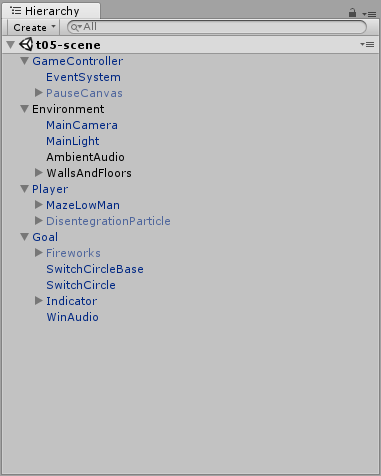
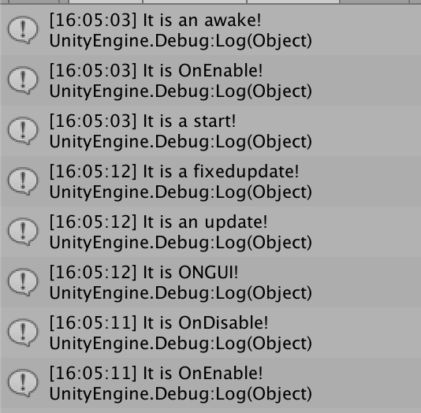
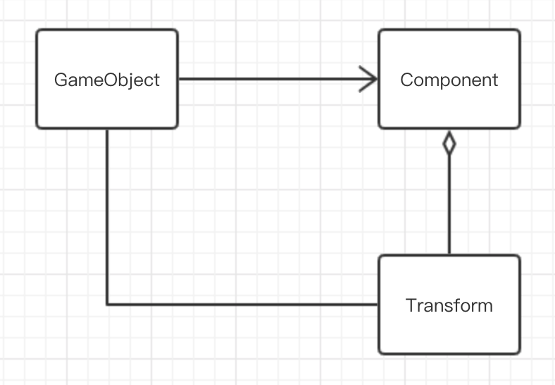
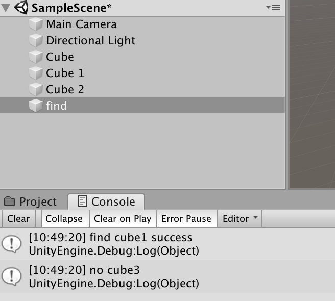
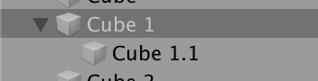
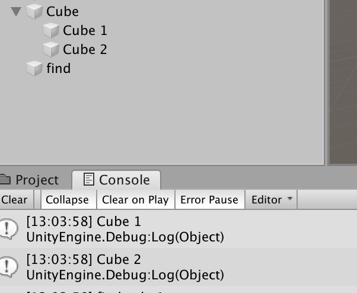
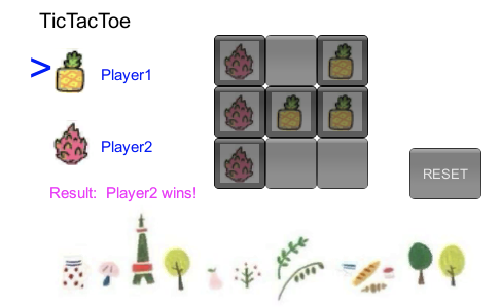

#### 简答题

1. 解释 游戏对象（GameObjects） 和 资源（Assets）的区别与联系。
- 对象：游戏中出现在游戏场景中的元素。包括抽象的对象，比如玩家、BOSS。以及实例化的子类对象，比如LOL中的某一个英雄。是资源整合的具体表现。
- 资源：资源包含对象、场景、声音、质感、动作等元素，可以被对象使用。有一些可以应用给对象，比如英雄的皮肤，有一些可以直接作为游戏中具体的对象。

2. 下载几个游戏案例，分别总结资源、对象组织的结构（指资源的目录组织结构与游戏对象树的层次结构）*
- 资源的目录组织结构：资源按内容、插件等分类，将声音、文本等不同类型的资源文件按照目录的结构整理。


- 游戏对象树的层次结构：对象按照环境、玩家等以树形结构逐步实例化。


3. 编写一个代码，使用 debug 语句来验证 MonoBehaviour 基本行为或事件触发的条件
- 基本行为包括 Awake() Start() Update() FixedUpdate() LateUpdate()
- 常用事件包括 OnGUI() OnDisable() OnEnable()
```c
using System.Collections;
using System.Collections.Generic;
using UnityEngine;
public class testMono : MonoBehaviour
{
    private void Awake()
    {
        Debug.Log("It is an awake!");
    }
    void Start()
    {
        Debug.Log("It is a start!");
    }
    void Update()
    {
        Debug.Log("It is an update!");
    }
    private void FixedUpdate()
    {
        Debug.Log("It is a fixedupdate!");
    }
    private void OnGUI()
    {
        Debug.Log("It is ONGUI!");
    }
    private void OnDisable()
    {
        Debug.Log("It is OnDisable!");
    }
    private void OnEnable()
    {
        Debug.Log("It is OnEnable!");
    }
}
```
控制台输出：

- `awake`：当一个脚本实例被载入时被调用
- `start`：在所有update函数之前被调用一次
- `update`：当行为启用时，其update在每一帧被调用
- `fixedupdate`：当行为启用时，其fixedupdate在每一时间片被调用
- `OnGUI`：渲染和处理GUI事件时调用
- `OnEnable`：当对象变为可用或激活状态时被调用（点对象前面的勾）
- `OnDisable`：当对象变为不可用或非激活状态时被调用

4. 查找脚本手册，了解 GameObject，Transform，Component 对象
- 分别翻译官方对三个对象的描述（Description）
  - GameObject：Base class for all entities in Unity Scenes.
  Unity场景中所有实体的基类。
  - Transform：Position, rotation and scale of an object.
  物体的位置、旋转和缩放。
  - Compoent：Base class for everything attached to GameObjects.
  所有附加到游戏对象上的基类。

- 描述下图中 table 对象（实体）的属性、table 的 Transform 的属性、 table 的部件
  - 本题目要求是把可视化图形编程界面与 Unity API 对应起来，当你在 Inspector 面板上每一个内容，应该知道对应 API。

  
  table 的对象是 GameObject，第一个选择框是 activeSelf 属性，文本框是对象的名称（chair），后面是static属性，第二行是Tag（标签）和Layer（层级），第三行是Prefab（预设）的选项。Transform有position（位置），Rotation（旋转），Scale（大小）。table的部件包括Transform，Cube，Box Collider，Mesh Renderer。

- 用 UML 图描述 三者的关系


5. 整理相关学习资料，编写简单代码验证以下技术的实现：
- 查找对象
根据对象名称。也可以根据标签。
`public static GameObject FindWithTag(string tag);`
```c
void Start()
    {
        GameObject find1 = GameObject.Find("Cube 1");
        if (find1 == null)
        {
            Debug.Log("no cube1");
        }
        else
        {
            Debug.Log("find cube1 success");
        }
        GameObject find2 = GameObject.Find("Cube 3");
        if (find2 == null)
        {
            Debug.Log("no cube3");
        }
        else
        {
            Debug.Log("find cube1 success");
        }
    }
```
控制台输出：

- 添加子对象
```c
void Start()
    {
        GameObject create = GameObject.CreatePrimitive(PrimitiveType.Cube);
        create.name = "Cube 1.1";
        create.transform.position = new Vector3(0, Random.Range(0, 5), 0);
        create.transform.parent = this.transform;
    }
```
将代码应用到Cube 1，运行会有一个新的子对象。
控制台输出：

- 遍历对象树
```c
void Start()
    {
        foreach (Transform child in transform)
        {
            Debug.Log(child.name);
        }
    }
```
将代码应用到Cube 1，会显示所有子对象。
控制台输出：

- 清除所有子对象
```c
void Start()
    {
        foreach (Transform child in transform)
        {
            Destroy(child.gameObject);
        }
    }
```

6. 资源预设（Prefabs）与 对象克隆 (clone)
- 预设（Prefabs）有什么好处？
预设可以方便的大量使用同一对象，当修改的时候，只需要修改预设中的属性，所有对象的属性都将被修改。
- 预设与对象克隆 (clone or copy or Instantiate of Unity Object) 关系？
克隆只是复制一个游戏对象，对象和副本之间是相互独立的。并且只能从已有的对象克隆，预设可以在创建项目时导入。
- 制作 table 预制，写一段代码将 table 预制资源实例化成游戏对象
`Instantiate(prefab, new Vector3(0f, 0f, 0f), Quaternion.identity);`

#### 编程实践，小游戏

- 游戏内容： 井字棋 或 贷款计算器 或 简单计算器 等等
- 技术限制： 仅允许使用 IMGUI 构建 UI
- 作业目的：
  - 了解 OnGUI() 事件，提升 debug 能力
  - 提升阅读 API 文档能力


[井字棋项目链接](https://github.com/anjahappy/3DGameHomework2)
[参考项目1](https://blog.csdn.net/vc43vc/article/details/81987802) [参考项目2](https://blog.csdn.net/vc43vc/article/details/81987802)
